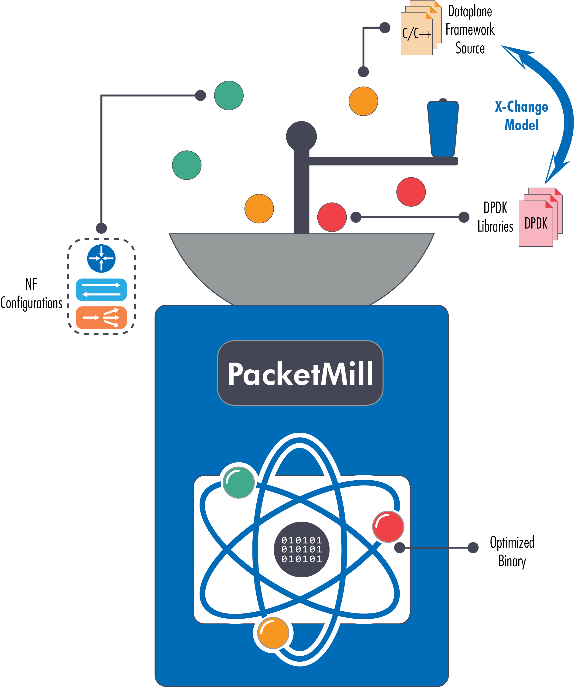

# PacketMill: Toward per-core 100-Gbps Networking

PacketMill is a system for optimizing software packet processing, which (i) introduces a new model ([X-Change][x-change-repo]) to efficiently manage packet metadata and (ii) employs code-optimization techniques to better utilize commodity hardware. PacketMill grinds the whole packet processing stack, from the high-level network function configuration file to the low-level userspace network (specifically Data Plane Development Kit or [DPDK][dpdk-page]) drivers, to mitigate inefficiencies and produce a customized binary for a given network function.

<p align="center">

</p>
<p align="center">
<sub>Some of the symbols used in this image are modified versions of vectors published by <a href="https://www.freevector.com/">www.freevector.com</a>.</sub>
</p>


PacketMill is composed of three main components:

1. **X-Change:** developed as an Application Programming Interface (API) within DPDK, which realizes customized
buffers when using DPDK, rather than relying on the generic ***rte_mbuf*** structure;
2. **Source-code modifications:** implemented on top of a resurrected & modified ***click-devirtualize***, exploiting
the information defining a NF (i.e., Click configuration file) to mitigate virtual calls, improve constant propagation & constant folding; and
1. **IR-based modifications:** implemented as LLVM optimization passes applied to the complete program’s IR bitcode
as extracted from Link-Time Optimization (LTO), which reoders the commonly used data structures (i.e., ***Packet*** class in FastClick).

For more information, please refer to PacketMill's [paper][packetmill-paper].


**We are currently working on the camera-ready version of PacketMill paper, but you can check out our submitted [extended abstract][packetmill-extended-abstract] to [ASPLOS'21][asplos21-page].**

## Applicability

We have developed/tested PacketMill for/on [FastClick][fastclick-repo], but our techniques could be adapted to other packet processing frameworks.

### X-Change (Modified DPDK)

We modified the `MLX5` PMD used by Mellanox NICs in DPDK. However, X-Change is applicable to other drivers, as other (e.g., Intel) drivers are implemented similarly and have the same inefficiencies. Although we have only tested X-Change with FastClick, other DPDK-based packet processing frameworks (e.g., BESS and VPP) could equally benefit from X-Change, as our proposed model only modifies DPDK userspace drivers.


### Code Optimizations

We implemented our source-code optimizations on top of [click-devirtualize][devirtualize-paper], but it is possible to apply the same optimization to other packet processing frameworks such as BESS and VPP.


## What is included here?

This repository contains information/source code to use PacketMill and reproduce some of the results presented in our ASPLOS'21 [paper][packetmill-paper].

Our paper' results are also available at `paper-results/`. 


## Experiments

The experiments are located at `experiments/`. The folder has a `Makefile` and `README.md` that can be used to run the experiments.

**Note: Before running the experiments, you need to prepare your testbed according to the following guidelines.**


## Testbed

Our experiments mainly requires `npf`, `X-Change`, `FastClick`, `LLVM toolchain`, `perf`, and `pmu-tools`. There is a simple bash script (`setup_repo.sh`) that could help you to clone/compile different repositories, but you should mainly rely on this `README.md`. 

### Network Performance Framework (NPF) Tool

You can install `npf` via the following command:

```bash
python3 -m pip install --user npf
```

**Do not forget to add `export PATH=$PATH:~/.local/bin` to `~/.bashrc` or `~/.zshrc`. Otherwise, you can run `npf-compare` and `npf-run` commands.** 

NPF will look for `cluster/` and `repo/` in your current working/testie directory. We have included the required `repo` for our experiments and a sample `cluster` template, available at `experiment/`. To setup your cluster, please check the [guidelines][npf-setup] for our previous paper. Additionally, you can check the [NPF README][npf-readme] file.

### X-Change (Modified DPDK) and Normal DPDK

To build X-Change with clang (LTO), you can run the following commands:

```bash
git clone git@github.com:tbarbette/xchange.git
cd xchange
make install T=x86_64-native-linux-clanglto
```

After building X-Change, you have to define `XCHG_SDK` and `XCHG_TARGET`. To do so, run:

```bash
export XCHG_SDK=/home/alireza/packetmill/xchange/
export XCHG_TARGET=x86_64-native-linux-clanglto
```

We also use normal DPDK v20.02 in some scenarios. To build it, you can run the following commands:

```bash
git clone git@github.com:tbarbette/xchange.git dpdk
cd dpdk
git checkout v20.02
make install T=x86_64-native-linux-gcc
make install T=x86_64-native-linux-clang
```

After building DPDK, you have to define `RTE_SDK` and `RTE_TARGET`. To do so, run:

```bash
export RTE_SDK=/home/alireza/packetmill/dpdk/
export RTE_TARGET=x86_64-native-linux-gcc
```


**Note that `NPF` requires all three builds to perform the experiments. It uses `gcc` build (of DPDK v20.02) for packet generation (i.e., default case) and the other two (i.e., X-Change with `clanglto` and DPDK v20.02 with `clang`) for other scenarios at the server side.**

Fore more information, please check X-Change [repository][x-change-repo].

### LLVM Toolchain

We used `LLVM 10.0.0` in our paper. To install it, run the following command:

```bash
chmod +x llvm-clang.sh
sudo ./llvm-clang.sh 10
```

This command will also create some links to different LLVM tools and clang commands. Check the script (`llvm-clang.sh`) for more details.

### Perf and PMU Tools

We use `perf` and `pmu-tools` to gather microarchitectural metrics. To install them, run the following commands:

```bash
sudo apt-get install linux-cloud-tools-$(uname -r) linux-tools-$(uname -r)
git clone https://github.com/andikleen/pmu-tools.git
```

### FastClick

NPF automatically clone and build FastClick for the experiments (based on the testie/npf file), but if you want to compile/build it manually with X-Change repo. You can run the following commands:

```bash
git clone --branch packetmill git@github.com:tbarbette/fastclick.git
cd fastclick
./configure --disable-linuxmodule --enable-userlevel --enable-user-multithread --enable-etherswitch --disable-dynamic-linking --enable-local --enable-dpdk=$RTE_SDK --enable-research --enable-flow --disable-task-stats --enable-cpu-load --prefix $(pwd)/build/ --enable-intel-cpu --enable-rand-align  RTE_TARGET=x86_64-native-linux-clanglto CXX="clang++ -flto -fno-access-control" CC="clang -flto" CXXFLAGS="-std=gnu++14 -O3" LDFLAGS="-flto -fuse-ld=lld -Wl,-plugin-opt=save-temps" RANLIB="/bin/true" LD="ld.lld" READELF="llvm-readelf" AR="llvm-ar" --disable-bound-port-transfer --enable-dpdk-pool --enable-dpdk-xchg --disable-dpdk-packet
make
sudo make uninstall
sudo make install
```

`make install` requires some perl packages. For instance, you might need to run the following command if `make install` fails.

```bash
sudo cpan File::Which
```

**Note: if you have already exported X-Change (or DPDK) environment variables, you do not need to pass `RTE_SDK` and/or `RTE_TARGET` in the configure line. However, using `--enable-dpdk=$RTE_SDK` is mandatory if you have a globally installed DPDK (e.g. using apt or ninja install); it forces FastClick to use the right DPDK (e.g., X-Change).**

Building FastClick with this configuration uses X-Change by default, i.e., providing `Packet` class to DPDK PMD (`MLX5`). However, it is possible to use other metadata management techniques. The following list summarizes the required compilation flags for different metadata management models. 

* **X-Change:** `--enable-dpdk-xchg --disable-dpdk-packet`
* **Copying:** `--disable-dpdk-packet`
* **Overlaying:** `--enable-dpdk-packet`

For more information, please refer to PacketMill's [paper][packetmill-paper]. 


### Binutils

We used `bintuils 2.32`. To install/update bintuils, please refer to [here][binutils-page]. **Beware binutils 2.30, which comes with Ubuntu 18.04 has a bug with AVX512. See DPDK commit [e19c6de3][dpdk-commit-link].**

### LLVM Pass - Reordering Pass

We developed an optimization pass (via LLVM) that reorders the variables/fields of the `Packet` [class][packet-header-fastclick] (i.e., the metadata structure in FastClick) based on the access pattern of the input binary. As our source-code modifications customizes the binary and removes the unused elements (source code), applying our pass together with other optimizations ultimately results in a customized data structure for the input NF configuration.

Our pass parses the whole-program IR code produced by LTO (clang) to finds the references (done by the NF)
to different variables/fields of the `Packet` class, sorts these variables based on the estimated number of accesses to the variables, and fixes (repairs) the references to the `Packet` class done by the LLVM’s GetElementPtrInst (GEPI) instruction.

After applying the pass, the output IR code can be relinked with the dynamic libraries to produce a new binary for FastClick. 

**Note that recompiling/relinking the IR code requires removing/striping module flags, we have a simple module pass that performs this task.**

* **Building:** To compile our passes, run the following commands:

```bash
cd LLVM
mkdir build
cd build
cmake ..
make
```

* **Using:** Compiling FastClick & X-Change with LTO (clang) while using `plugin-opt=save-temps` flag produces four IR bitcode (i.e., whole-program IR code):

```bash
click.0.0.preopt.bc
click.0.2.internalize.bc
click.0.4.opt.bc
click.0.5.precodegen.bc
```

or 

```bash
embedclick.0.0.preopt.bc
embedclick.0.2.internalize.bc
embedclick.0.4.opt.bc
embedclick.0.5.precodegen.bc
```

You can use `llvm-dis` tool to convert them into human-readable LLVM assembly language. For example, try:

```bash
llvm-dis click.0.5.precodegen.bc -o click.ll
```

or

```bash
llvm-dis embedclick.0.5.precodegen.bc -o embedclick.ll
``` 

You can apply the passes on the `embedclick.ll` via the following commands:

```bash
cd /home/alireza/fastclick/userlevel/
opt -S -load /home/alireza/packetmill/LLVM/build/class-stripmoduleflags-pass/libClassStripModuleFlagsPass.so -strip-module-flags click.ll -o click.ll
opt -S -load /home/alireza/packetmill/LLVM/build/class-handpick-pass/libClassHandpickPass.so -handpick-packet-class click.ll -o click.ll
opt -S -O3 click.ll -o click.ll
make click-opt
```

or

```bash
cd /home/alireza/fastclick/userlevel/
opt -S -load /home/alireza/packetmill/LLVM/build/class-stripmoduleflags-pass/libClassStripModuleFlagsPass.so -strip-module-flags embedclick.ll -o embedclick.ll
opt -S -load /home/alireza/packetmill/LLVM/build/class-handpick-pass/libClassHandpickPass.so -handpick-packet-class embedclick.ll -o embedclick.ll
opt -S -O3 embedclick.ll -o embedclick.ll
make embedclick-opt
```


### Useful Information about writing LLVM Passes

* Adrian Sampson blog post: http://www.cs.cornell.edu/~asampson/blog/llvm.html
* Adrian Sampson Skeleton pass: https://github.com/sampsyo/llvm-pass-skeleton
* Writing an LLVM Pass: https://llvm.org/docs/WritingAnLLVMPass.html


## Citing our paper

If you use PacketMill or X-Change in any context, please cite our [paper][packetmill-paper]:

```bibtex
@inproceedings{farshin-packetmill,
author = {Farshin, Alireza and Barbette, Tom and Roozbeh, Amir and {Maguire Jr.}, Gerald Q. and Kosti\'{c}, Dejan},
title = {PacketMill: Toward per-core 100-Gbps Networking},
year = {2021},
publisher = {Association for Computing Machinery},
address = {New York, NY, USA},
booktitle = {Proceedings of the Twenty-Sixth International Conference on Architectural Support for Programming Languages and Operating Systems},
keywords = {Packet Processing, Metadata Management, PacketMill, X-Change, 100 Gbps, Network Function Virtualization (NFV), Click, DPDK, Link-Time Optimization (LTO), LLVM},
location = {Virtual},
series = {ASPLOS '21}
}
```

## Getting Help

If you have any questions regarding our code or the paper, you can contact [Alireza Farshin][alireza-page] (farshin at kth.se) and/or [Tom Barbette][tom-page] (barbette at kth.se).


[x-change-repo]: https://github.com/tbarbette/xchange
[dpdk-page]: https://www.dpdk.org/
[packetmill-paper]: https://people.kth.se/~farshin/documents/packetmill-asplos21.pdf
[packetmill-extended-abstract]: https://people.kth.se/~farshin/documents/packetmill-asplos21-extended_abstract.pdf
[asplos21-page]: https://asplos-conference.org/2021
[packetmill-repo]: https://github.com/aliireza/packetmill 
[fastclick-repo]: https://github.com/tbarbette/fastclick
[tom-page]: https://www.kth.se/profile/barbette
[alireza-page]: https://www.kth.se/profile/farshin/
[devirtualize-paper]: https://pdos.csail.mit.edu/~rtm/papers/click-asplos02.pdf
[ddio-testbed]: https://github.com/aliireza/ddio-bench/blob/master/TESTBED.md 
[npf-setup]: https://github.com/aliireza/ddio-bench/blob/master/TESTBED.md#network-performance-framework-npf-tool
[npf-readme]: https://github.com/tbarbette/npf/blob/master/README.md
[binutils-page]: https://www.gnu.org/software/binutils/
[packet-header-fastclick]: https://github.com/tbarbette/fastclick/blob/master/include/click/packet.hh
[dpdk-commit-link]: https://github.com/DPDK/dpdk/commit/e19c6de3f2f12d0f49bdf9e787b3f43612c1df3c