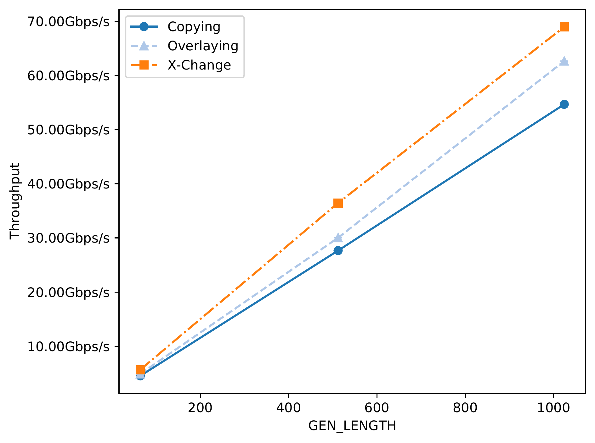
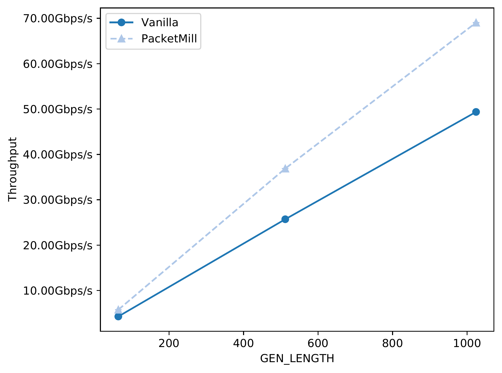

# Experiments

This folder contains the NPF scripts to run some experiments using PacketMill.

## ASPLOS'21 Artifact Evaluation

Most of the experiments in [our paper][packetmill-paper] have been performed using a captured trace from the KTH campus. Unfortunately, we would not be able to make the campus trace available to the public due to GDPR. However, we provide the following experiments that use synthetic traces (i.e., fixed-size flows) to validate the reusability and effectiveness of PacketMill. To run all of these experiments, use `make AE`.

**Note that you need to setup your testbed before running any experiment.**

The details of the experiments are as follows:

- `Source-code Modifications (Router)`: This experiment shows the benefits of using our proposed source-code optimizations when a router is receiving **64-B**, **512-B**, and **1024-B** packets. This experiment uses default DPDK v20.02 (compiled with clang) and copying metadata management model. You can use `make test_sourcecode_router` to run this experiment. The output of the experiment should be similar to the following figure:

- `X-Change (Forwarder)`: This experiment compares the performance of different metadata management model: (i) copying, (ii) overlaying, and (iii) X-Change, where a single core is forwarding fixed-size packets. Note that this experiment uses LTO in all configurations. You can use `make test_xchg_fwd` to run this experiment. The output of the experiment should be similar to the following figure:

- `PacketMill (Router)`: This experiment applies PacketMill to a router that receives fixed-size packets. This experiment also uses a fixed-size traces. You can use `make test_packetmill_router` to run this experiment. The output of the experiment should be similar to the following figure:

- `Sophisticated Network Functions (Router+IDS+VLAN)`: This experiment demonstrates the benefits of PacketMill for a router+IDS configuration, where a single core is receiving fixed-size packets. You can use `make test_packetmill_ids` to run this experiment. The output of the experiment should be similar to the following figure:

**To run all of these experiments, use `make AE`.** 

## Other Experiments

This section provides additional information to perform other experiments using our provided NPF testie file (i.e., `packetmill.npf`). 

### Changing Frequency

We have set the processor's frequency to `2.3 GHz` in AE experiment. You can rerun the experiments in another frequency by changing the value of `FREQ=2300` in the `packetmill.npf`. You can also run the experiment for multuple frequencies using `freqrun` tag. You need to add to a Makefile rule after "--tag" flag, e.g., `--tag freqtune`. In this case, you have to define/change the values of `freqtune:FREQ` in the `packetmill.npf`. 

### Using Trace

To run the experiments with a trace, you should remove `udp` tag from the experiment rule defined in `Makefile` and substitute the current value of `trace` in the `packetmill.npf` file. Note that `packetmill.npf` has multiple `trace` variables, as you could have multiple packet generators. Moreover, you should "fine-tune" the `TIMING` variable in `packetmill.npf` if you are planning to replay the input trace at different rates. 

### IR-code Optimizations + LTO

Our testie file also contains the workflow to reorder `Packet` data structure based on the binary access pattern, i.e., tracking and changing `GEPI` instruction in either `click` or `embedclick` binaries. To try it out, you can use `make test_llvm_pass_router`.

### Multicore NAT

You can run the multicore NAT experiment via: `make test_packetmill_nat`. Note that you need to have a trace for this experiment. 

### Porfile-Guided Optimization (PGO) + BOLT Binary Optimizer

To be added. 

[packetmill-paper]: https://people.kth.se/~farshin/documents/packetmill-asplos21.pdf