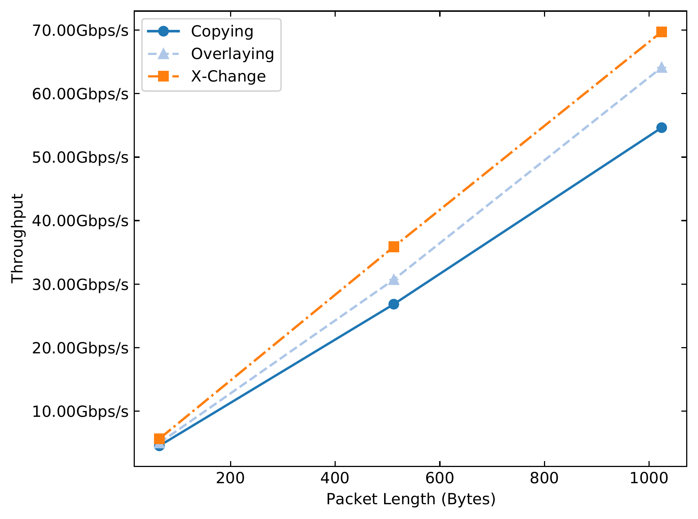
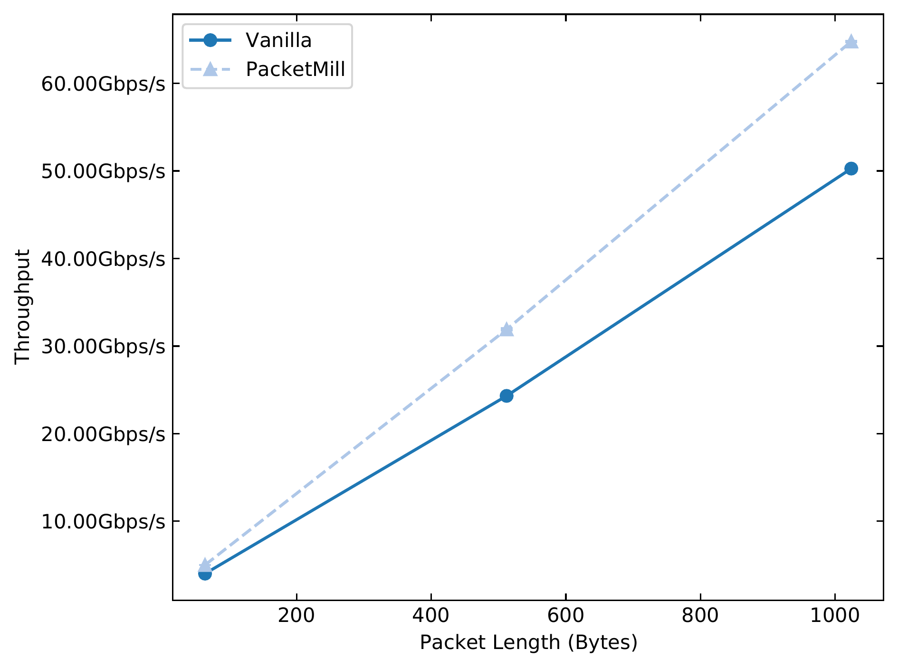
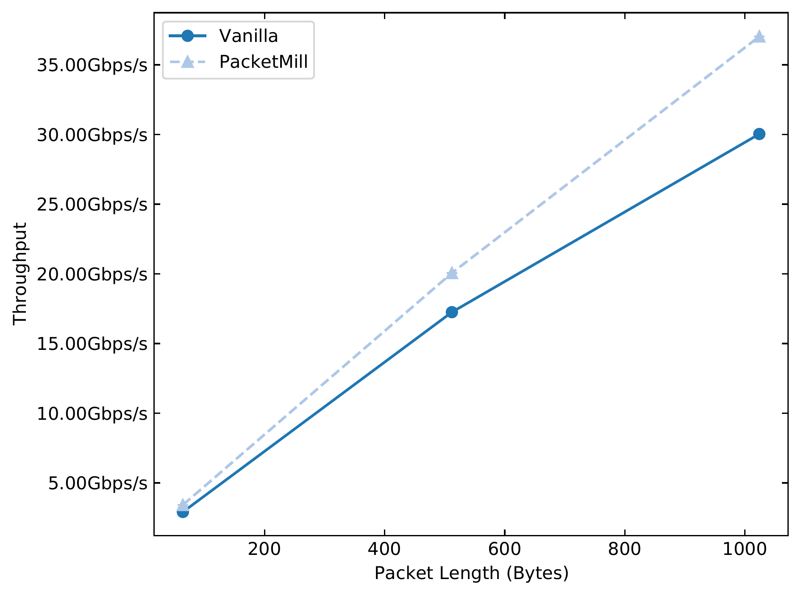
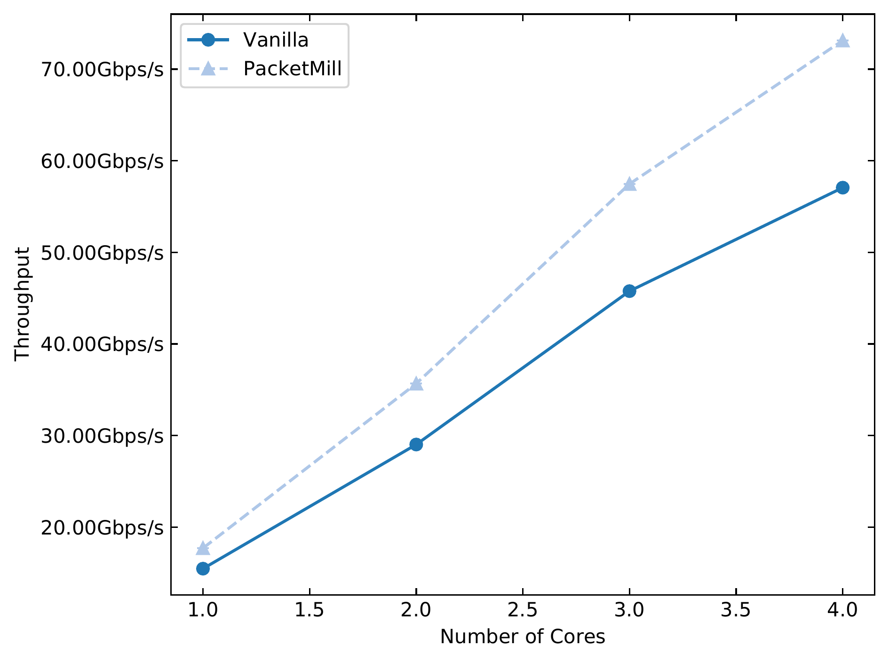
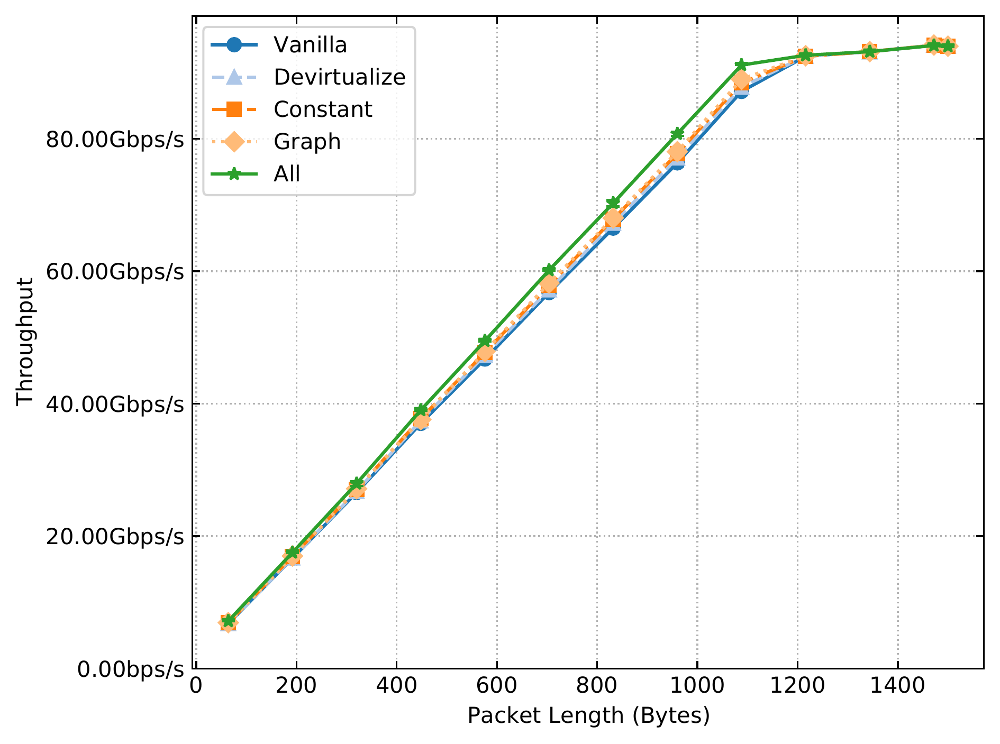
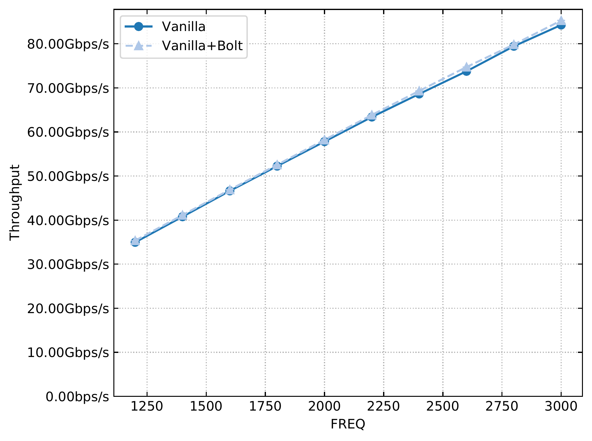

# Experiments

This folder contains the NPF scripts to run some experiments using PacketMill.

## ASPLOS'21 Artifact Evaluation

Most of the experiments in [our paper][packetmill-paper] have been performed using a captured trace from the KTH campus. Unfortunately, we would not be able to make the campus trace available to the public due to GDPR. However, we provide the following experiments that use synthetic traces (i.e., fixed-size flows) to validate the reusability and effectiveness of PacketMill. To run all of these experiments, use `make AE`.

**Note that you need to setup your testbed before running any experiment.**

The details of the experiments are as follows:

- `X-Change (Forwarder)`: This experiment compares the performance of different metadata management model: (i) copying, (ii) overlaying, and (iii) X-Change, where a single core is forwarding fixed-size packets. Note that this experiment uses LTO in all configurations. You can use `make test_xchg_fwd` to run this experiment. The output of the experiment should be similar to the following figure:

<p align="center">

</p>

- `PacketMill (Router)`: This experiment applies PacketMill to a router that receives fixed-size packets. This experiment also uses a fixed-size traces. You can use `make test_packetmill_router` to run this experiment. The output of the experiment should be similar to the following figure:

<p align="center">

</p>

- `Sophisticated Network Functions (Router+IDS+VLAN)`: This experiment demonstrates the benefits of PacketMill for a router+IDS configuration, where a single core is receiving fixed-size packets. You can use `make test_packetmill_ids` to run this experiment. The output of the experiment should be similar to the following figure:

<p align="center">

</p>

- `Multicore NAT (Router+NAT)`: This experiment demonstrates the benefits of PacketMill for a router+NAT configuration, where different number of cores are receiving 1024-B packets. You can use `make test_packetmill_nat` to run this experiment. The output of the experiment should be similar to the following figure:

<p align="center">

</p>

You can run the multicore NAT experiment via: `make test_packetmill_nat`. Note that you need to have a trace for this experiment. 

- `Source-code Modifications (Router)`: This experiment shows the benefits of using our proposed source-code optimizations when a router is receiving **64-B**, **512-B**, and **1024-B** packets. This experiment uses copying metadata management model. You can use `make test_sourcecode_router` to run this experiment. The output of the experiment should be similar to the following figure:

<p align="center">

</p>

**Note that this figure is showing a slightly different improvements than the results reported in our paper, as we use (i) fixed-size packets rather than our real campus trace, (ii) improved version of baseline (i.e., main branch of FastClick is merged into PacketMill branch), and (iii) different system configurations (i.e., different software packages and firmwares).**

## Other Experiments

This section provides additional information to perform other experiments using our provided NPF testie file (i.e., `packetmill.npf`). 

### Changing Frequency

We have set the processor's frequency to `2.3 GHz` or `3.0 GHz` in AE experiment. You can rerun the experiments in another frequency by changing the value of `FREQ=2300` in the `packetmill.npf`. You can also run the experiment for multuple frequencies using `freqtune` tag. You need to add to a Makefile rule after "--tag" flag, e.g., `--tag freqtune`. In this case, you have to define/change the values of `freqtune:FREQ` in the `packetmill.npf`. 

### Using Trace

To run the experiments with a trace, you should remove `udp` tag from the experiment rule defined in `Makefile` and substitute the current value of `trace` in the `packetmill.npf` file. Note that `packetmill.npf` has multiple `trace` variables, as you could have multiple packet generators. Moreover, you should "fine-tune" the `TIMING` variable in `packetmill.npf` if you are planning to replay the input trace at different rates. 

### Using WorkPackage Element

To emulate the behavior of more memory- and compute-intensive functions, you can use `make test_packetmill_wp`. This experiment uses `WorkPackage` element from FastClick with different parameters. You can check [here][workpackage-cc] for more information. 

### IR-code Optimizations + LTO

Our testie file also contains the workflow to reorder `Packet` data structure based on the binary access pattern, i.e., tracking and changing `GEPI` instruction in either `click` or `embedclick` binaries. To try it out, you can use `make test_llvm_pass_router`.


### Porfile-Guided Optimization (PGO) + BOLT Binary Optimizer

- **BOLT:** You can use `make test_bolt` or `make test_compare_bolt`  to apply BOLT binary optimizer to FastClick. To use BOLT, you need to prepare your testbed as follows:

```bash
cd packetmill/
git clone https://github.com/llvm-mirror/llvm llvm-bolt
cd llvm-bolt/tools
git checkout -b llvm-bolt f137ed238db11440f03083b1c88b7ffc0f4af65e
git clone https://github.com/facebookincubator/BOLT llvm-bolt
patch -p 1 < tools/llvm-bolt/llvm.patch
cd ..
mkdir -p build
cd build
cmake -G Ninja ../ -DLLVM_TARGETS_TO_BUILD="X86;AArch64" -DCMAKE_BUILD_TYPE=Release -DLLVM_ENABLE_ASSERTIONS=ON
ninja
```

Fore more information, please check their [repo][bolt-repo] and [paper][bolt-paper].

The output of `test_compare_bolt` should be something similar to the following figure:

<p align="center">

</p>

- **PGO:** You can use `make test_pgo` to apply PGO to FastClick. TO use PGO, you need clone and compile `AutoFDO` tool to convert perf output.

```bash
git clone --recursive https://github.com/google/autofdo.git
aclocal -I .; autoheader; autoconf; automake --add-missing -c
./configure
make -j 1
```

For more information, please check [clang user manual][clang-pgo] and autofdo [repo][autofdo-repo].

- **Comparisson:** You can use `make test_bolt_pgo` to compare the performance of vanilla FastClick with different optimized versions. 

### BESS

You can use `make test_bess` to run [BESS][bess-page] with one core when it forwards fixed-size packets. Before trying it, make sure to install the BESS dependencies, as follows:

```bash
sudo apt-get install -y python python-pip libgraph-easy-perl
pip install --user protobuf grpcio scapy
```


For more information, please refer to [BESS README][bess-readme]. 


### VPP

You can use `make test_vpp` to run [VPP][vpp-page] with one core when it forwards fixed-size packets. Before trying it, make sure to install VPP once, as follows:

```bash
git clone https://github.com/FDio/vpp.git
cd vpp
git checkout v20.05
make install-dep
make dpdk-install-dev DPDK_MLX5_PMD=y DPDK_MLX5_PMD_DLOPEN_DEPS=y
make build-release vpp_uses_dpdk_mlx5_pmd=yes DPDK_MLX5_PMD_DLOPEN_DEPS=y
```

For more information, please refer to [VPP README][vpp-readme]. 


### X-Change Examples (l2fwd-xchg)

We developed a sample application, called `l2fwd-xchg`, for DPDK to support X-Change, which is a modified version of the L2 forwarding sample application ([l2fwd][l2fwd-page]). In this example, the metadata is reduced to two simple fields (i.e., the buffer address and packet length) instead of the 128-B `rte_mbuf`. You can use `make test_xchg_l2fwd_dpdk` to compare `l2fwd` with `l2fwd-xchg`. Make sure to build them before running the test. To do so, you have to go to the `xchange/examples/l2fwd/` and ``xchange/examples/l2fwd-xchg/`directories and run `make`.

**Make sure to define `RTE_SDK` and `RTE_TARGET` to X-Change path before running `make`. You have to revert them back to the previous values according to the [main README][main-readme-xchg].**


### Compare Packet Processing Frameworks

You can run `make test_xchg_app` to compare the performance of l2fwd, l2fwd-xchg, FastClick, PacketMill, BESS and VPP. Note that this test disables vectorized PMD.

[packetmill-paper]: https://people.kth.se/~farshin/documents/packetmill-asplos21.pdf
[bolt-repo]: https://github.com/facebookincubator/BOLT
[bolt-paper]: https://research.fb.com/publications/bolt-a-practical-binary-optimizer-for-data-centers-and-beyond/
[clang-pgo]: https://clang.llvm.org/docs/UsersManual.html#profile-guided-optimization
[autofdo-repo]: https://github.com/google/autofdo
[workpackage-cc]: https://github.com/tbarbette/fastclick//blob/master/elements/research/workpackage.cc
[bess-page]: http://span.cs.berkeley.edu/bess.html
[bess-readme]: https://github.com/NetSys/bess/blob/master/README.md
[vpp-page]: https://fd.io/vppproject/vpptech/
[vpp-readme]: https://github.com/FDio/vpp/blob/master/README.md
[l2fwd-page]: https://doc.dpdk.org/guides/sample_app_ug/l2_forward_real_virtual.html
[main-readme-xchg]: https://github.com/aliireza/packetmill/blob/master/README.md#x-change-modified-dpdk-and-normal-dpdk